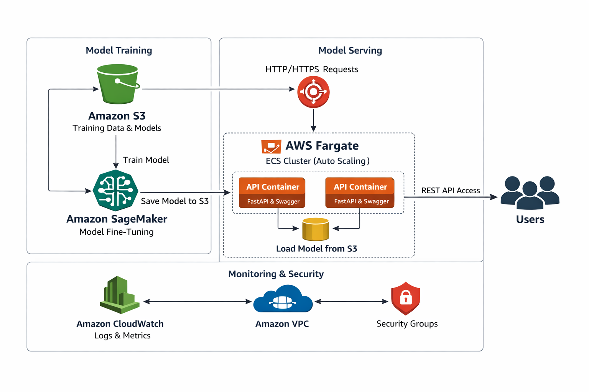

# iFood ML Engineer Test

The goal of the exercises below is to evaluate the candidate knowledge and problem solving expertise regarding the main development focuses for the iFood Generative AI Platform.

## Generative AI model serving

Part of the ML Engineer job is to ensure the models developed by the Data Scientists are correctly deployed to the production environment, and are accessible via a REST microservice.

And when we're talking about Generative AI models, the flow is a bit different from "classical" AI.

### Deliverables

There are two goals for this exercise. The first one is to create an automated Generative AI model fine-tuning process.

The second one is to create a Rest API documented with Swagger that serves predictions for a given fine-tuned Generative AI model.

This process/pipeline should be generic enough to use any base models, with any data.

Languages, frameworks, platforms are not a constraint, but your solution must be inside a docker image, docker compose, script or notebook ready to be run. Training a model or serving the Rest API/Swagger structure should be as simple as running a script or something similar. You should also provide a README file on how to execute the training job, and how to request the API or Swagger. There are a lot of tools that solve most of this problem; while you are free to use them, please try to balance the time you will save by using them with being able to show your programming skills by not using them as much.

## AWS infrastructure

The last skill a ML Engineer must have is cloud proficiency. For iFood, AWS is our cloud of choice.

For this exercise, we would like for you to propose an AWS architecture to serve a solution for one of the two previous exercises. A single page describing the resources needed is sufficient, although you are free to provide code if you like it. Please have in mind that this structure must be reliable, scalable and as cheap as possible without compromising the other two requisites.

## SOLUTION

The solution for this case containerizes both the training and serving processes using Docker, and orchestrates them with Docker Compose, ensuring reproducibility and simplicity.

### Project Structure
- `Dockerfile`: environment for training/fine-tuning
- `Dockerfile.api`: environment for the API
- `docker-compose.yml`: orchestrates training and API services
- `data/`: dataset for training (e.g., `train.jsonl`)
- `output/`: directory where the fine-tuned model is saved
- `api.py`: FastAPI application serving predictions with Swagger

### How to Run

1. Replace your training data in `./data/train.jsonl` 
2. Train the model using: `docker-compose run train`
3. The fine-tuned model will be saved in `./output`.
4. To serve predictions run: `docker-compose up api`
5. Test the model with Swagger UI:
    Access: http://localhost:8000/docs. Select `POST /predict`. Click `Try it out`. Enter a prompt and execute.
6. Test the API Using curl:
    `curl -X POST "http://localhost:8000/predict" \
        -H "Content-Type: application/json" \
        -d '{"prompt":"Once upon a time","max_length":50}'`
   
7. Expected response:
    {
    "prompt": "Once upon a time",
    "generated_text": "Once upon a time in a magical world..."
    }

### Notes
- The base model can be changed by editing the training command in `docker-compose.yml` (e.g., --model gpt2, --model bert).
- Training and API are separated into distinct services to keep the API image lightweight.
- The shared volume `./output` ensures the trained model is available to the API.
- This pipeline is generic and can be adapted to different models and datasets.

## Second part: AWS infrastructure
The second part of this test is to present a AWS arquitecture to serve the solution above. 
I'd like to propose the use of the following modules:
- `S3`: for data storage
- `SageMaker`: for the fine-tunning step (and the output will also be salved on S3).
- `ECS Fargate`: to run the containerized FastAPI app
- `Application Load Balancer (ALB)`: Routes HTTP/HTTPS traffic to the API containers.
- `CloudWatch`: for monitoring and logs

